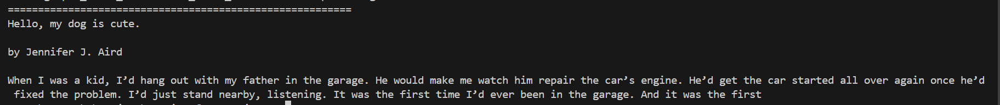

# Basic LLM chatbot

This project utilizes the `transformers` library to generate texts for given prompts using a pre-trained model from Huggingface. The specific model used is `gpt-neo-2.7B`. NOTE: Can swap with any text-to-text / text generation model available on huggingface.

## 📝 Description

The **Basic LLM Chatbot** project is designed to generate text for any given text prompt. This can be particularly useful for understanding how to work with huggingface models and learning some basic parameters for these LLM-type projects. This is a much simpler chatbot just made for learning purposes. If you want something advanced, check out my other works.

## 🚀 Getting Started

The above code will download the model 'gpt-neo-2.7B' on your machine locally, and it doesn't even require an API key. Make sure you have enough space for that. Once you are done, you can use the model offline. Feel free to swap them out and try different models.

### Prerequisites

Ensure you have the following dependencies installed:
- Python 3.7 or higher

### Setting Up a Virtual Environment

It is recommended to use a virtual environment to manage your dependencies. You can set up a virtual environment using the following commands:

```sh
# Create a virtual environment
python -m venv venv

# Activate the virtual environment
# On Windows
venv\Scripts\activate
# On macOS/Linux
source venv/bin/activate
```

### Installing Dependencies
You can install the necessary dependencies using pip:
```pip install transformers torch p```

### 📸 Screenshot
Below is a screenshot of the program in action:
<div align="center">
  
</div>

### 📁 Repository Structure
image_captioner.py: The main script to run the image captioning.
resource: Folder containing the images and screenshots

### 🤝 Contributing
Contributions are welcome! Feel free to fork the repository and submit pull requests. For major changes, please open an issue first to discuss what you would like to change.

### 📞 Connect with Me
I'm always open to new connections and opportunities. Feel free to reach out if you have any questions, suggestions, or just want to connect!
Email: swamibhuvanesan@gmail.com
LinkedIn: Swaminathan

### 🌟 Acknowledgements
A big thank you to the developers and contributors of the transformers library and the Huggingface.

<p align="center">
  Made with ❤️ by Swaminathan
</p>
